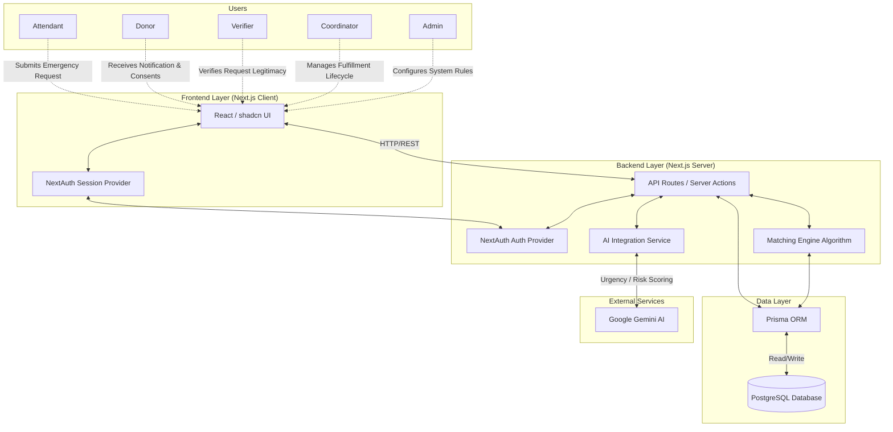
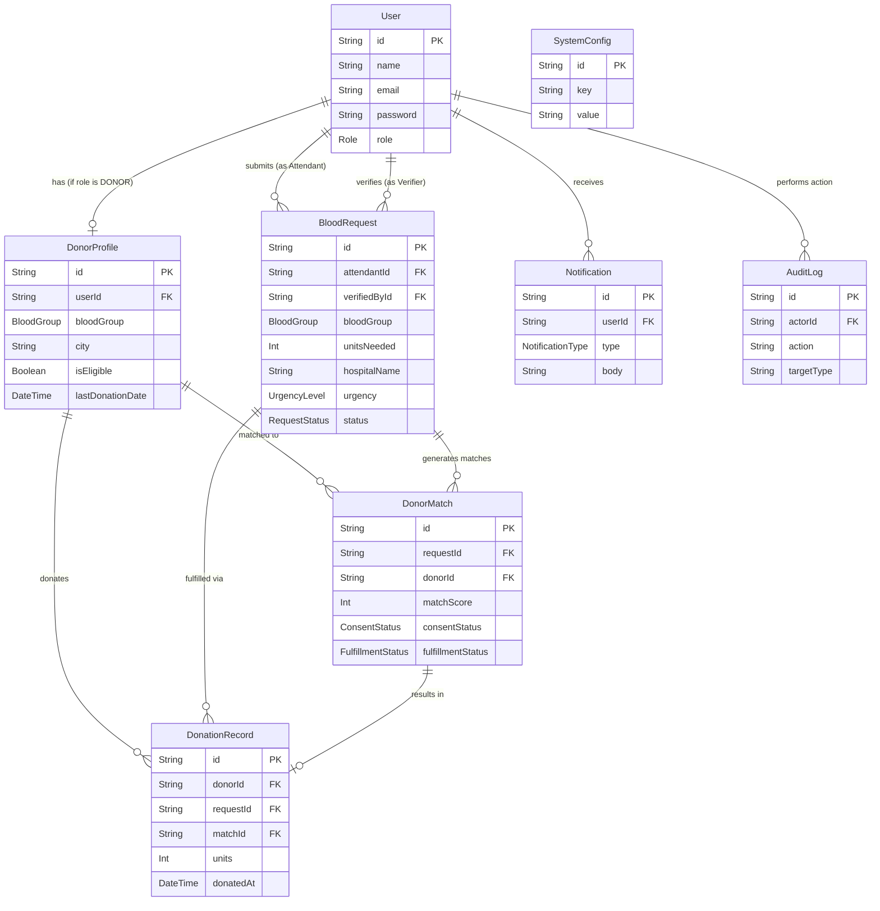

# System Architecture & ERD Diagrams

This document contains the visual representations of the system architecture and the database schema for the Blood Donation Emergency Matching System. These diagrams are generated using Mermaid syntax.

## 🏗️ System Architecture Diagram

This diagram illustrates how the different user roles interact with the Next.js full-stack application, how the backend services communicate with external AI, and the data flow into the PostgreSQL database.

---

## 🗄️ Database Schema (ERD)

This Entity-Relationship Diagram (ERD) outlines the core database tables and how they relate to one another to form the foundation of the matching system.

## How to View These Diagrams
If you are viewing this file on **GitHub**, GitHub will automatically render these Mermaid code blocks into visual diagrams. 
If you are viewing this locally, you can use any markdown previewer that supports Mermaid (such as the Markdown Preview Enhanced extension for VS Code) or copy the code blocks into [Mermaid Live Editor](https://mermaid.live).
